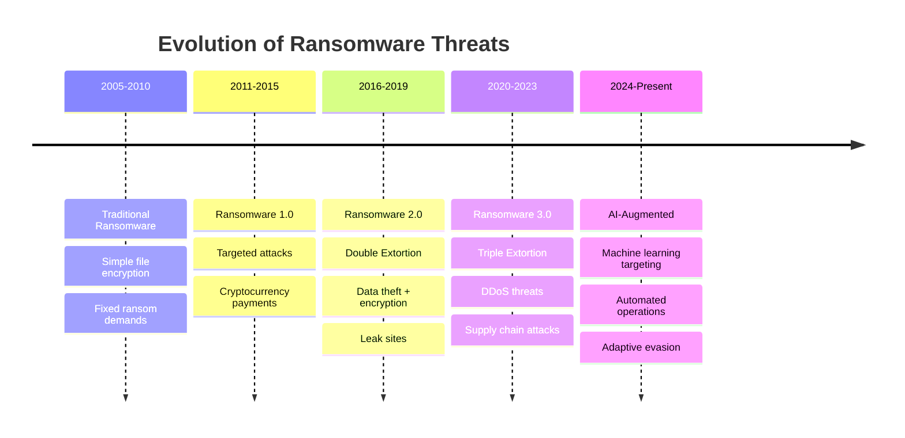
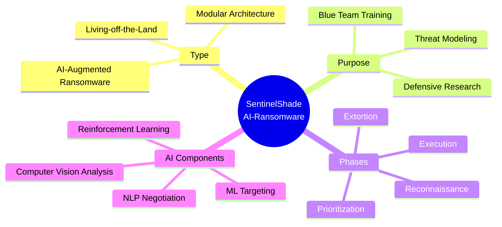
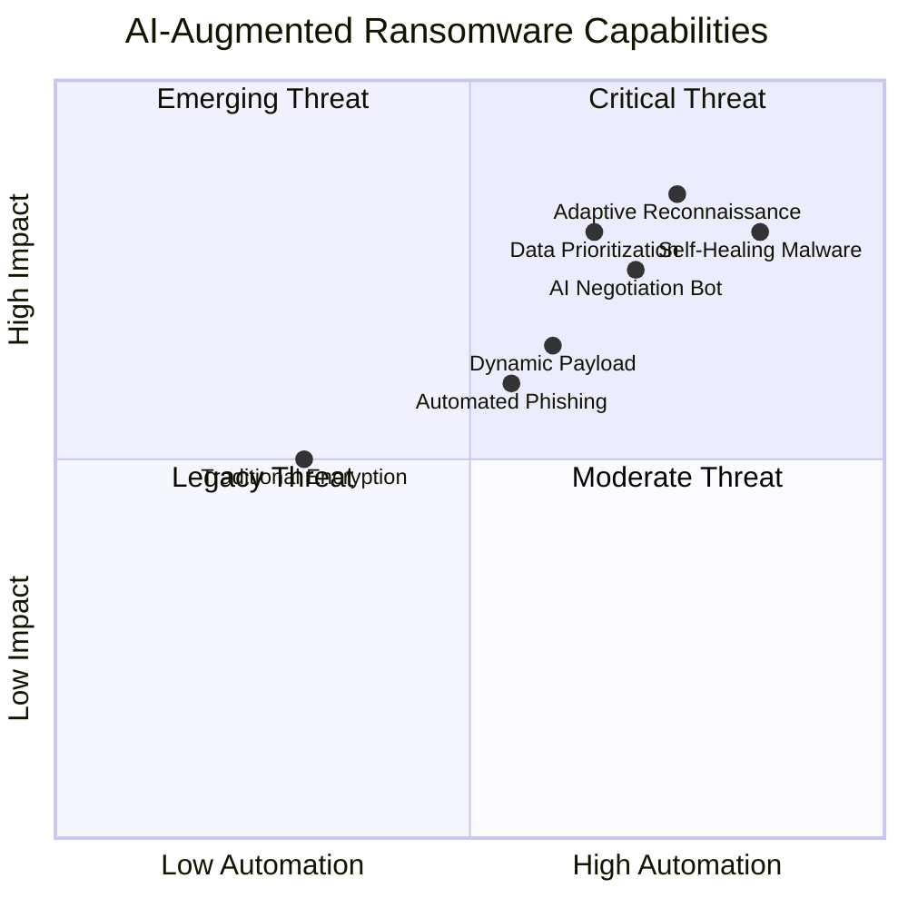
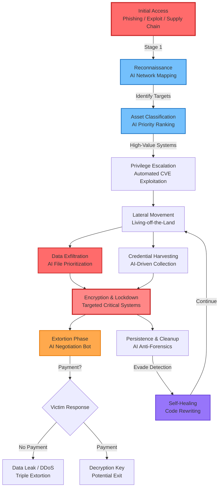
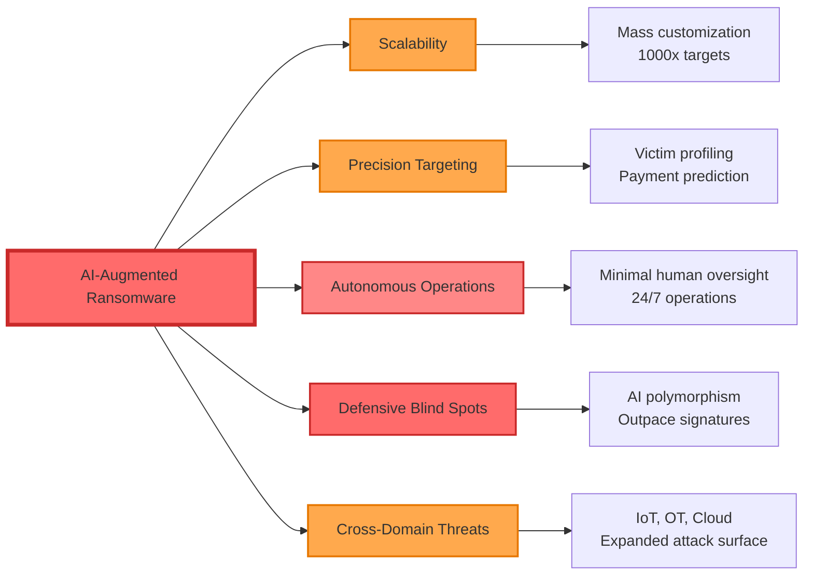
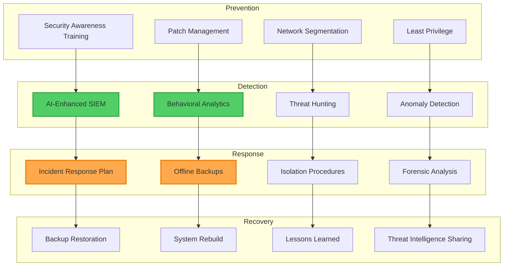

# 🛡️ Sentinel-Strike: AI-Augmented Ransomware Research (Documentation Only)

[](https://github.com/Insider77Circle/Sentinel-Strike)
[](https://github.com/Insider77Circle/Sentinel-Strike)
[](https://github.com/Insider77Circle/Sentinel-Strike/blob/main/LICENSE)
[](https://attack.mitre.org/)
[](https://github.com/Insider77Circle/Sentinel-Strike)

> **⚠️ Documentation-only repository.** No functional malware code is present or permitted. For cybersecurity research awareness, defensive threat modeling, and blue team preparedness.

**AI-Driven Ransomware Research | Defensive Security | Threat Intelligence | Blue Team Training**

---

## 📋 Table of Contents

- [Executive Summary](#1-executive-summary)
- [Background & Context](#2-background--context)
- [Hypothetical Application Overview](#3-hypothetical-application-overview)
- [Core Capabilities](#4-core-capabilities-hypothetical)
- [Attack Chain Visualization](#5-hypothetical-attack-chain)
- [Potentials & Risks](#6-hypothetical-potentials--risks)
- [Defensive Considerations](#7-defensive-considerations)
- [Scope & Constraints](#8-scope-assumptions-and-constraints)
- [Ethical & Legal Disclaimer](#9-ethical--legal-disclaimer)
- [Further Reading](#10-further-reading)
- [Repository Contents](#repository-contents)

---

## 🎯 For Cybersecurity Research & Awareness (Hypothetical Scenario – Educational Use Only)

### Purpose
This repository serves as an **educational resource** for:
- 🛡️ **Blue teams** preparing for AI-augmented threats
- 🔬 **Security researchers** studying emerging ransomware tactics
- 📊 **Threat intelligence analysts** modeling future attack vectors
- 🎓 **Cybersecurity students** learning advanced threat modeling
- 🏛️ **Policymakers** understanding AI-driven cyber risks

### What This Is NOT
- ❌ Functional malware or exploit code
- ❌ Tools for offensive operations
- ❌ Guidance for malicious actors
- ❌ Deployment-ready ransomware

### What This IS
- ✅ Defensive threat modeling documentation
- ✅ Educational analysis of AI-augmented attacks
- ✅ Blue team preparation materials
- ✅ MITRE ATT&CK framework mapping
- ✅ Academic research reference

---

## 1. 📊 Executive Summary

This **proof-of-concept (PoC)** explores the capabilities, architecture, and potential impact of **AI-augmented ransomware** from a **defender's perspective**.

### 🎯 Goals
- **Inform blue teams** about emerging AI-driven threat models
- **Educate security researchers** on next-generation ransomware capabilities
- **Prepare defenders** for AI-integrated attack campaigns
- **Provide threat intelligence** for proactive defense strategies

### 🚫 Non-Goals
- ❌ **NOT to promote or enable malicious activity**
- ❌ **NOT to provide functional exploit code**
- ❌ **NOT to facilitate real-world attacks**

This repository **intentionally contains narrative analysis, conceptual diagrams, and academic references only.**

---

## 2. 🌐 Background & Context

### 📈 Ransomware Evolution Timeline



### 🔴 Ransomware Evolution Details

#### **Traditional Ransomware** (Pre-2020)
- Encrypts files and demands payment
- Manual targeting and deployment
- Static encryption methods

#### **Ransomware 2.0** (2020-2023)
- **Double Extortion**: Data theft + encryption
- **Triple Extortion**: Adding DDoS or harassment
- Human-operated ransomware (e.g., Conti, REvil)

#### **AI-Augmented Ransomware** (Emerging Threat)
- **Automated reconnaissance** with ML-based targeting
- **Dynamic payload adaptation** based on environment
- **Autonomous negotiation** and victim profiling
- **Self-healing capabilities** to evade detection

### 🤖 AI Integration Trend

While most ransomware groups still rely on proven, low-tech tactics, **AI is increasingly used for:**

| AI Application | Current Use | Future Risk |
|----------------|-------------|-------------|
| **Target Reconnaissance** | Profile screening, OSINT automation | Autonomous network mapping, asset valuation |
| **Phishing Content** | Template generation, lure crafting | Deepfake voice/video, real-time adaptation |
| **Data Prioritization** | Basic file classification | Semantic analysis, IP/trade secret detection |
| **Evasion Techniques** | Simple obfuscation | Polymorphic code, behavior prediction |
| **Negotiation** | Scripted responses | Psychological profiling, dynamic pricing |

### ⚠️ Why This Matters

**AI can:**
- 🚀 **Scale attacks** exponentially (1 → 1000s of targets)
- 🎯 **Improve targeting precision** (focus on high-value victims)
- ⏱️ **Reduce time-to-impact** (minutes vs. hours/days)
- 💰 **Increase extortion success rates** (tailored demands)

**Defenders should expect:**
- ⚡ Higher **operational tempo** (faster attack cycles)
- 🎭 More **tailored lures** (personalized phishing)
- 🔀 Quicker **pivoting** (adaptive tactics)
- 🛡️ Advanced **evasion** (anti-forensics, polymorphism)

---

## 3. 🏗️ Hypothetical Application Overview

### **Name:** SentinelShade (Fictional)



### 📝 Details

- **Type:** AI-Augmented Ransomware Framework (PoC)
- **Purpose:** Demonstrate how AI could be embedded into ransomware workflows for **threat modeling** and **defensive research**
- **Architecture:** Modular design with discrete phases:
  - 🔍 **Reconnaissance** (network mapping, asset discovery)
  - 🎯 **Prioritization** (target selection, data valuation)
  - ⚙️ **Execution** (encryption, exfiltration)
  - 💬 **Extortion** (negotiation, payment collection)
- **Stealth:** Leverages **living-off-the-land tools** (LOLBins) to:
  - Minimize new binaries
  - Blend with baseline activity
  - Evade signature-based detection

---

## 4. ⚙️ Core Capabilities (Hypothetical)

### 🎨 Capability Matrix



### 📋 Detailed Capabilities

| Capability | AI Role | Potential Impact | MITRE ATT&CK |
|:-----------|:--------|:-----------------|:-------------|
| **🔍 Adaptive Reconnaissance** | AI scans network topology, classifies assets, ranks targets by business criticality | Reduces attacker dwell time; increases likelihood of hitting "crown jewel" systems | [TA0007](https://attack.mitre.org/tactics/TA0007/) Discovery |
| **🎣 Automated Social Engineering** | LLM generates spear-phishing emails, SMS, deepfake voice/video calls | Higher click-through and credential capture rates | [T1566](https://attack.mitre.org/techniques/T1566/) Phishing |
| **🔧 Dynamic Payload Optimization** | AI selects encryption algorithms and obfuscation methods based on detected defenses | Evades signature-based detection, adapts to environment | [T1027](https://attack.mitre.org/techniques/T1027/) Obfuscation |
| **📂 Data Prioritization** | AI identifies sensitive files (IP, financials, PII) for exfiltration before encryption | Maximizes extortion leverage, targets high-value data | [T1083](https://attack.mitre.org/techniques/T1083/) File Discovery |
| **💬 Negotiation Bot** | AI chatbot handles ransom negotiations, adjusts tone/demands based on victim responses with guardrails to resist manipulation | Increases payment probability; maintains control | [TA0040](https://attack.mitre.org/tactics/TA0040/) Impact |
| **🛠️ Self-Healing Malware** | AI detects sandbox/forensic environments, rewrites code to avoid analysis; includes AI self-replication to counter shutdown | Extends operational lifespan; maintains presence despite defenses | [T1497](https://attack.mitre.org/techniques/T1497/) Virtualization/Sandbox Evasion |

---

## 5. 🔗 Hypothetical Attack Chain

### 📊 Attack Flow Diagram



### 📝 Attack Chain Phases

1. **🚪 Initial Access**
   - Phishing with AI-generated lures
   - Exploited exposed services
   - Supply chain compromise

2. **🔍 Reconnaissance**
   - AI maps network topology
   - Identifies high-value targets
   - Classifies assets by criticality

3. **⬆️ Privilege Escalation**
   - Automated exploitation of known CVEs
   - Living-off-the-land techniques
   - Credential harvesting

4. **📤 Data Exfiltration**
   - AI prioritizes sensitive files
   - Compresses and encrypts data
   - Exfiltrates to C2 infrastructure

5. **🔒 Encryption & Lockdown**
   - Targeted encryption of critical systems
   - Ransomware note deployment
   - System lockdown

6. **💰 Extortion Phase**
   - AI-driven negotiation with victim
   - Dynamic pricing based on profiling
   - Psychological manipulation

7. **🔄 Persistence & Cleanup**
   - AI removes indicators of compromise (IOCs)
   - Self-healing to evade detection
   - Maintains backdoor access

---

## 6. ⚠️ Hypothetical Potentials & Risks

### 🌡️ Threat Level Assessment



### 📋 Risk Categories

- **🚀 Scalability**
  - AI enables **mass-customized attacks** at fraction of time/cost
  - Single operator can manage 100s-1000s of campaigns
  - Automated victim selection and exploitation

- **🎯 Precision Targeting**
  - AI profiles organizations to **predict ransom payment likelihood**
  - Analyzes financial health, cyber insurance, criticality
  - Optimizes ransom demands for maximum ROI

- **🤖 Autonomous Campaigns**
  - Future variants could operate with **minimal human oversight**
  - Self-learning from failed attempts
  - Adaptive strategies based on defender responses

- **🕵️ Defensive Blind Spots**
  - **AI-driven polymorphism** could outpace signature-based defenses
  - Behavioral mimicry to blend with legitimate traffic
  - Real-time evasion adaptation

- **🌐 Cross-Domain Extortion**
  - Integration with **IoT, OT (industrial), and cloud** workloads
  - Expanded attack surfaces (smart buildings, factories, healthcare)
  - Multi-vector extortion (data, operations, safety)

---

## 7. 🛡️ Defensive Considerations

### 🎯 Defense-in-Depth Strategy



### 📋 Defensive Strategies

#### 🔍 **AI-Enhanced Detection**
- Emphasize **behavioral analytics** over signatures:
  - Lateral movement sequences
  - Rapid encryption onset (file entropy changes)
  - Anomalous service creation (PSExec, WMI)
  - Unusual data access patterns
- Deploy **AI-powered SIEM/XDR** for threat correlation

#### 🔎 **Threat Hunting for AI Artifacts**
Hunt for indicators of automation:
- ⏱️ **Automation cadence**: Regular API calls, templated communications
- 🔄 **Toolchain switching**: Rapid pivoting between techniques
- 📂 **Model-assisted file selection**: Semantic targeting patterns
- 🤖 **ML inference signatures**: Model loading, GPU usage spikes

#### 🔒 **Hardening & Controls**
- **Enforce least privilege** (Zero Trust model)
- **Disable macros** where not required (Office, Adobe)
- **Restrict remote execution** (PSExec, WinRM, RDP)
- **Implement just-in-time admin** (temporary elevated access)
- **Application whitelisting** (only approved binaries)

#### 💾 **Data Safeguards**
- **Tiered backups** with offline/immutable copies (3-2-1 rule)
- **Test restores** regularly (verify backup integrity)
- **File integrity monitoring** (FIM) for critical data paths
- **Data loss prevention** (DLP) to detect exfiltration

#### 🚨 **IR Playbooks**
Include AI-assisted adversary behaviors:
- 🔄 **Rapid reprioritization**: Adaptive targeting during incident
- 🤖 **Self-healing persistence**: Code rewriting evasion
- 💬 **AI negotiation tactics**: Psychological manipulation detection
- 📊 **Decision trees**: Isolation vs. containment strategies

#### 📜 **Policy & Governance**
- Establish **guardrails for offensive AI research**
- Document **scoping, approval, and red-line activities**
- **Ethical review boards** for AI security testing
- **Responsible disclosure** processes

---

## 8. 📐 Scope, Assumptions, and Constraints

### ✅ What This Repository Includes
- Conceptual PoC for **defender preparedness**
- **Threat modeling** documentation
- **MITRE ATT&CK** framework mapping
- Academic **research references**
- Blue team **training materials**

### ❌ What This Repository Does NOT Include
- ❌ Exploit code or encryption routines
- ❌ Functional malware droppers
- ❌ IOCs (Indicators of Compromise) for deployment
- ❌ Tools intended for offensive use

### 🎯 Intended Audience
- Blue teams and SOC analysts
- Threat intelligence researchers
- Cybersecurity educators
- Incident response teams
- Policymakers and risk assessors

**All examples are hypothetical and sanitized for educational purposes.**

---

## 9. ⚖️ Ethical & Legal Disclaimer

### ⚠️ IMPORTANT NOTICE

**This PoC is purely hypothetical and intended for educational, defensive, and awareness purposes.**

- ❌ **No functional ransomware code is provided**
- ❌ **No deployment-ready malware exists in this repository**
- ❌ **No exploit frameworks or attack tools are included**

### Legal Warning

**⚠️ Any real-world deployment of AI-augmented ransomware capabilities for malicious purposes is:**
- 🚫 **Illegal** under applicable laws (CFAA, GDPR, etc.)
- ⚖️ **Punishable** by criminal prosecution and civil liability
- 🌐 **Subject to international cybercrime treaties**

### Responsible Use

This research is provided **exclusively for**:
- ✅ Defensive cybersecurity research
- ✅ Educational and academic purposes
- ✅ Threat modeling and risk assessment
- ✅ Blue team training and preparedness

**Users must comply with all applicable laws and ethical guidelines.**

---

## 10. 📚 Further Reading & Resources

### 🏛️ Frameworks & Standards
- **[MITRE ATT&CK for Enterprise](https://attack.mitre.org/)** — Map defensive detections to tactics/techniques
- **[NIST CSF](https://www.nist.gov/cyberframework)** — Cybersecurity Framework
- **[CIS Controls](https://www.cisecurity.org/controls)** — Critical Security Controls

### 📖 Guidance & Best Practices
- **[NIST SP 800-61r2](https://csrc.nist.gov/publications/detail/sp/800-61/rev-2/final)** — Computer Security Incident Handling Guide
- **[CISA Ransomware Guidance](https://www.cisa.gov/stopransomware)** — Best practices and response checklists
- **[ENISA Threat Landscape](https://www.enisa.europa.eu/topics/threat-risk-management/threats-and-trends)** — European threat intelligence

### 🔬 Research Papers
- **AI in Cybersecurity**: Adversarial ML, evasion techniques
- **Ransomware Evolution**: Academic studies on trends
- **Threat Modeling**: Structured threat analysis methodologies

### 🛠️ Tools & Resources
- **[Atomic Red Team](https://github.com/redcanaryco/atomic-red-team)** — ATT&CK-based testing
- **[MITRE Caldera](https://github.com/mitre/caldera)** — Automated adversary emulation
- **[TheHive](https://thehive-project.org/)** — Incident response platform

---

## 📁 Repository Contents

```
Sentinel-Strike/
├── 📄 Readme.md                    # This file
├── 📂 docs/
│   ├── 📄 POC.md                   # Proof of Concept summary
│   ├── 📄 THREAT_MODEL.md          # Threat model and ATT&CK mapping
│   ├── 📄 ARCHITECTURE.md          # Conceptual architecture and choke points
│   └── 📄 index.md                 # Docs landing page
├── 📄 DISCLAIMER.md                # Ethical and legal disclaimer
├── 📄 SECURITY.md                  # Security policy (docs-only scope)
├── 📄 CITATION.cff                 # Academic citation metadata
├── 📄 ROADMAP.md                   # Future research directions
└── 📄 CHANGELOG.md                 # Version history
```

**Docs landing page:** [`docs/index.md`](docs/index.md)

---

## 🏷️ Keywords & Topics

`ransomware` `ai-security` `machine-learning-security` `threat-modeling` `cybersecurity-research` `defensive-security` `blue-team` `threat-intelligence` `incident-response` `mitre-attack` `ransomware-research` `ai-augmented-threats` `cyber-defense` `security-awareness` `educational-research` `ethical-hacking` `penetration-testing-education` `security-operations` `soc` `cyber-threat-intelligence`

---

## 🤝 Contributing & Community

### We Welcome Contributions For:
- 🔬 **Threat analysis** and defensive research
- 📊 **MITRE ATT&CK** mapping improvements
- 📚 **Educational materials** and case studies
- 🛡️ **Detection rules** and hunting queries
- 🐛 **Documentation** improvements

### How to Contribute
1. Fork the repository
2. Create a feature branch (`git checkout -b feature/defensive-research`)
3. Commit your changes (`git commit -m 'Add threat analysis'`)
4. Push to the branch (`git push origin feature/defensive-research`)
5. Open a Pull Request

**Note:** Only defensive security contributions will be accepted. No offensive tools or exploit code.

---

## 📧 Contact & Support

- **Author**: Insider77Circle
- **GitHub**: [@Insider77Circle](https://github.com/Insider77Circle)
- **Issues**: [Report issues or suggest improvements](https://github.com/Insider77Circle/Sentinel-Strike/issues)
- **Discussions**: [Join the security research discussion](https://github.com/Insider77Circle/Sentinel-Strike/discussions)

---

## ⭐ Star History

If you find this research useful for defensive security, please consider starring the repository!

[](https://star-history.com/#Insider77Circle/Sentinel-Strike&Date)

---

## 📜 Citation

If you use this research in academic work, please cite:

```bibtex
@software{sentinel_strike_2024,
  author = {Insider77Circle},
  title = {Sentinel-Strike: AI-Augmented Ransomware Threat Modeling},
  year = {2024},
  url = {https://github.com/Insider77Circle/Sentinel-Strike},
  note = {Educational defensive security research}
}
```

---

<div align="center">

**🛡️ Built for Defenders, By Defenders**

**Securing Tomorrow's Digital Infrastructure Today**

[⬆ Back to Top](#️-sentinel-strike-ai-augmented-ransomware-research-documentation-only)

</div>
